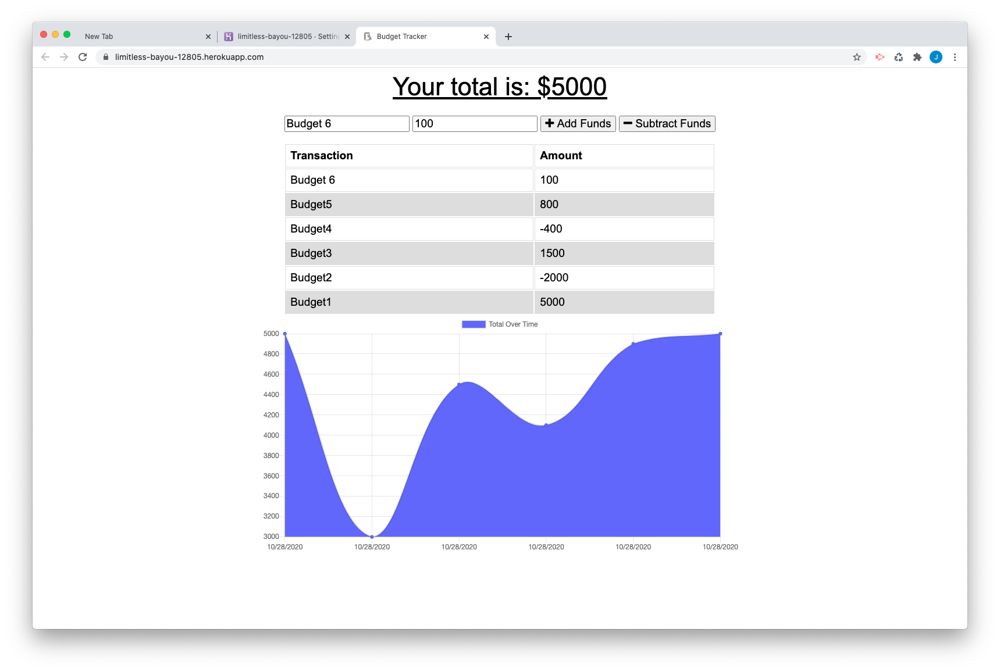

# Online-Offline-Budget-Trackers
18 PWA Homework

[Link to Deployed App](https://limitless-bayou-12805.herokuapp.com/)

## Table of Contents
  - [Description](#Description)
  - [Installation](#Installation)
  - [Usage](#Usage)
  - [License](#License)
  - [Tests](#Tests)

## Description

This application is a progressive web application that allows its user to track their budget by adding or deleting deposits both online and offline. 

## User Story

* AS AN avid traveller
* I WANT to be able to track my withdrawals and deposits with or without a data/internet connection
* SO THAT my account balance is accurate when I am traveling

## Installation / Technologies Used 

* NodeJS Express
* Mongoose
* MongoDB 

## Usage

  

## License
[MIT](https://opensource.org/licenses/MIT)

